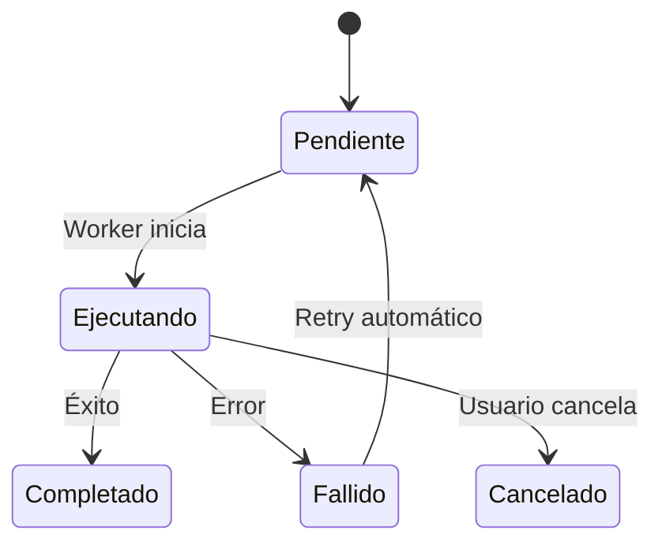

# HV-Bot - Automatización RPA

> Módulo de automatización robótica de procesos para interacción con portales gubernamentales.

## Ubicación

```
src/app/dashboard/bots/
├── page.tsx
├── actions.ts
└── bots-content.tsx
```

## Descripción

HV-Bot permite ejecutar tareas automatizadas en portales como el SII, Previred, y otros servicios gubernamentales chilenos, sin intervención manual.

## Funcionalidades

### 1. Panel de Bots
- Lista de bots configurados
- Estado actual (activo/inactivo/ejecutando)
- Última ejecución
- Estadísticas de éxito/fallo

### 2. Ejecución Manual
- Seleccionar bot
- Elegir cliente(s) objetivo
- Ejecutar inmediatamente
- Ver progreso en tiempo real

### 3. Historial de Jobs
- Últimas ejecuciones
- Estado de cada job
- Mensajes de error
- Botón de cancelar

### 4. Programación (futuro)
- Ejecución programada (cron)
- Frecuencias predefinidas

## Server Actions

### `getBots()`
Lista todos los bots definidos con estadísticas.

```typescript
interface BotConStats {
  id: string
  nombre: string
  descripcion: string
  portal: string  // 'sii' | 'previred' | 'tesoreria'
  activo: boolean
  ultimo_job: BotJob | null
  exitos_hoy: number
  fallos_hoy: number
}
```

### `getBotStats()`
Estadísticas agregadas del día.

```typescript
interface BotStats {
  totalBots: number
  activos: number
  tareasHoy: number
  erroresHoy: number
}
```

### `ejecutarBot(botId, clienteId?)`
Crea un nuevo job de ejecución.

```typescript
// Flujo:
1. Crear registro en bot_jobs (status: 'pendiente')
2. Worker externo detecta job y ejecuta
3. Actualiza status a 'ejecutando'
4. Registra logs en bot_logs
5. Finaliza con 'completado' o 'fallido'
```

### `cancelarJob(jobId)`
Cancela un job en ejecución.

### `getJobsRecientes(limite)`
Obtiene los últimos N jobs ejecutados.

## Bots Disponibles

| Bot | Portal | Función |
|-----|--------|---------|
| Descarga F29 | SII | Descargar PDF de F29 presentados |
| Obtener Situación | SII | Consultar situación tributaria |
| Libro Compras | SII | Descargar libro de compras |
| Libro Ventas | SII | Descargar libro de ventas |
| Certificado Cotizaciones | Previred | Obtener certificado |

## Estados de Job



## Tablas de Base de Datos

- `bot_definiciones` - Configuración de bots
- `bot_jobs` - Ejecuciones programadas/manuales
- `bot_logs` - Logs detallados de ejecución
- `credenciales_portales` - Credenciales encriptadas por cliente

## Seguridad

- Credenciales almacenadas encriptadas
- Ejecución en ambiente aislado
- Logs de auditoría completos
- Rate limiting por portal

## Ver también

- [[HV-F29 - Formularios Tributarios]]
- [[Clientes]]
