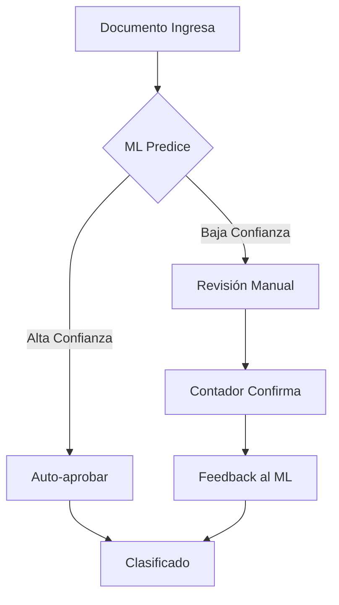

# HV-Class - Clasificador IA

> Módulo de clasificación automática de documentos tributarios usando Machine Learning.

## Ubicación

```
src/app/dashboard/clasificador/
├── page.tsx
├── actions.ts
└── clasificador-content.tsx
```

## Descripción

HV-Class utiliza un modelo de Machine Learning para clasificar automáticamente documentos tributarios (facturas, boletas, notas de crédito) en las cuentas contables correspondientes del plan de cuentas del cliente.

## Funcionalidades

### 1. Lista de Documentos Pendientes
- Muestra documentos sin clasificar
- Filtro por cliente
- Ordenamiento por fecha/monto
- Indicador de confianza del ML

### 2. Panel de Clasificación
- Sugerencias del modelo ML con porcentaje de confianza
- Top 3 cuentas sugeridas
- Búsqueda manual de cuentas
- Confirmación/reclasificación

### 3. Aprobación por Lote
- Aprobar automáticamente documentos con alta confianza (>90%)
- Revisión manual de baja confianza

## Server Actions

### `getDocumentosPendientes()`
Obtiene documentos con status 'pendiente' incluyendo predicciones ML.

```typescript
interface DocumentoConPrediccion {
  id: string
  folio: string
  rut_emisor: string
  razon_social_emisor: string
  monto_total: number
  fecha_emision: string
  cliente: { razon_social: string }
  predicciones: ClasificacionML[]
}
```

### `getCuentasContables(clienteId: string)`
Retorna el plan de cuentas del cliente.

### `confirmarClasificacion(documentoId, cuentaId)`
Confirma la clasificación sugerida o manual.

### `reclasificarDocumento(documentoId, cuentaId)`
Cambia la cuenta de un documento ya clasificado.

### `aprobarLoteAltaConfianza()`
Aprueba automáticamente documentos con confianza >90%.

## Estadísticas

| Métrica | Descripción |
|---------|-------------|
| Pendientes | Documentos sin clasificar |
| Clasificados Hoy | Documentos procesados hoy |
| Precisión ML | % de aciertos del modelo |
| Alta Confianza | Documentos con >90% confianza |

## Tablas de Base de Datos

- `documentos` - Documentos tributarios
- `clasificaciones_ml` - Predicciones del modelo
- `cuentas_contables` - Plan de cuentas
- `feedback_clasificacion` - Correcciones para reentrenamiento

## Flujo de Trabajo



## Ver también

- [[HV-F29 - Formularios Tributarios]]
- [[Esquema de Base de Datos]]
