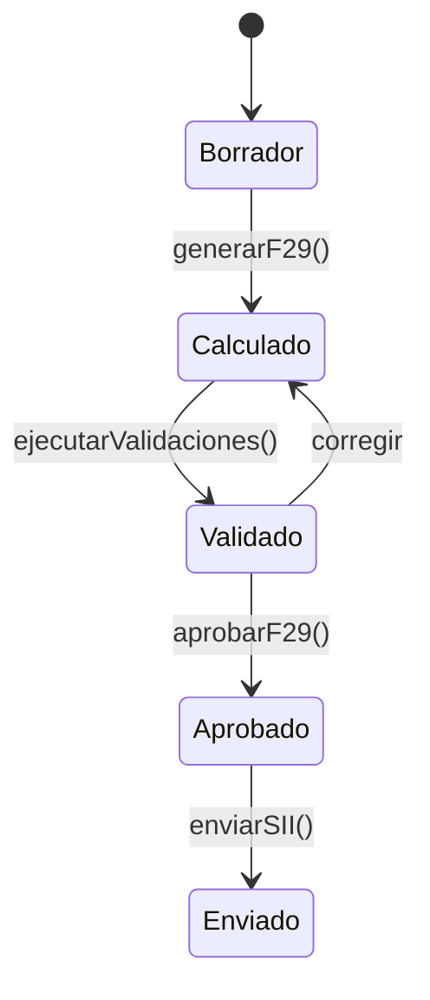

# HV-F29 - Formularios Tributarios

> Módulo de generación y validación automática de Formularios 29 para declaración mensual de IVA.

## Ubicación

```
src/app/dashboard/f29/
├── page.tsx
├── actions.ts
└── f29-content.tsx
```

## Descripción

HV-F29 automatiza la generación del Formulario 29 del SII a partir de los documentos clasificados, ejecuta validaciones cruzadas y permite la aprobación antes del envío.

## Funcionalidades

### 1. Lista de F29
- F29 por cliente y período
- Estados: borrador, calculado, validado, aprobado, enviado
- Filtros por estado y período

### 2. Generación Automática
- Calcula débito fiscal (código 89)
- Calcula crédito fiscal (código 538)
- Calcula PPM según régimen
- Arrastra remanente anterior

### 3. Validaciones
- Cuadratura IVA débito/crédito
- Consistencia con libro de compras/ventas
- Verificación de PPM
- Comparación con período anterior
- Montos mínimos requeridos

### 4. Panel de Aprobación
- Resumen de códigos principales
- Lista de validaciones con estado
- Botón de aprobar/rechazar

## Server Actions

### `getF29List(filtros?)`
Lista F29 con filtros opcionales.

```typescript
interface F29ConCliente {
  id: string
  periodo: string
  status: 'borrador' | 'calculado' | 'validado' | 'aprobado' | 'enviado'
  total_debito_fiscal: number
  total_credito_fiscal: number
  ppm_determinado: number
  total_a_pagar: number
  cliente: { razon_social: string; rut: string }
  validaciones: F29Validacion[]
}
```

### `generarF29(clienteId, periodo)`
Genera F29 a partir de documentos clasificados.

```typescript
// Flujo interno:
1. Obtener documentos del período
2. Calcular débito fiscal (ventas)
3. Calcular crédito fiscal (compras)
4. Calcular PPM según tasa del cliente
5. Determinar total a pagar
6. Guardar en f29_calculos
```

### `ejecutarValidaciones(f29Id)`
Ejecuta las 5 validaciones estándar.

```typescript
const validaciones = [
  'VAL001', // Cuadratura IVA
  'VAL002', // Libro compras
  'VAL003', // Libro ventas
  'VAL004', // PPM correcto
  'VAL005', // Variación período anterior
]
```

### `aprobarF29(f29Id)`
Marca F29 como aprobado si pasa validaciones.

## Códigos F29 Principales

| Código | Descripción |
|--------|-------------|
| 89 | Débito Fiscal del período |
| 538 | Crédito Fiscal del período |
| 77 | Remanente mes anterior |
| 563 | PPM obligatorio |
| 91 | Total a pagar |

## Tablas de Base de Datos

- `f29_calculos` - Cálculos por período/cliente
- `f29_codigos` - Detalle de cada código
- `f29_validaciones` - Resultados de validaciones

## Estados del F29



## Ver también

- [[HV-Class - Clasificador IA]]
- [[Clientes]]
