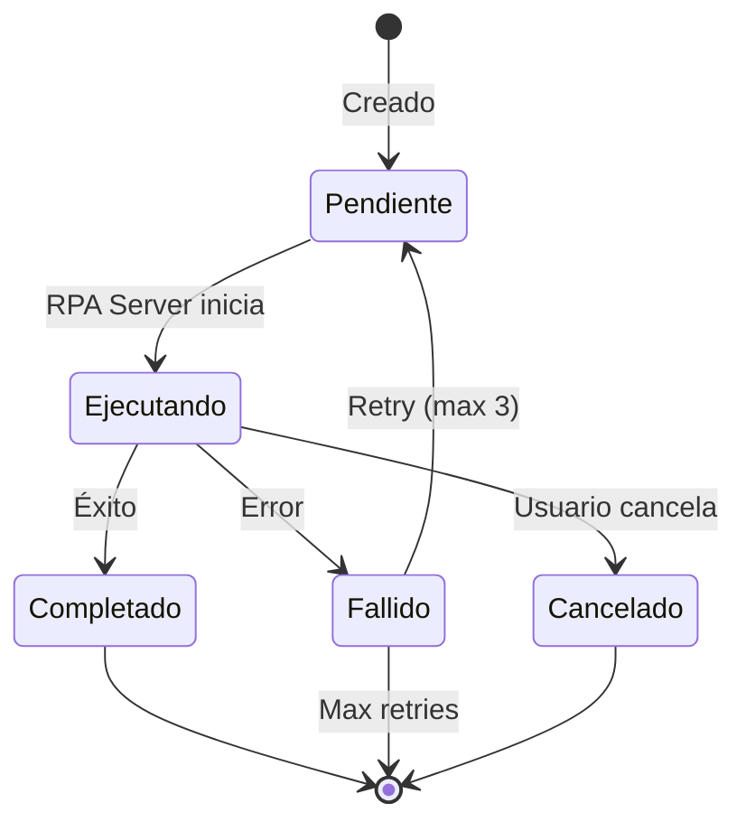

# SII-RPA - Automatización del Portal SII

> Sistema de automatización RPA (Robotic Process Automation) para el Servicio de Impuestos Internos de Chile usando Playwright.

**Status**: 🟢 Fases 1-5 Completadas (Listo para Producción)

---

## Resumen Ejecutivo

Sistema dedicado para automatizar tareas en el portal SII de Chile, incluyendo:
- Validación de credenciales
- Consulta de situación tributaria
- Descarga de libros de compras/ventas
- Envío y descarga de formulario F29
- Generación de certificados

---

## Arquitectura

```
┌─────────────────────────────────────────────────────────────┐
│                 Frontend (Next.js Dashboard)                 │
│           /dashboard/sii - Panel de control SII              │
└─────────────────────────────────────────────────────────────┘
                           ↓
┌─────────────────────────────────────────────────────────────┐
│              API Routes + Server Actions                     │
│    /api/sii-rpa/execute | /api/sii-rpa/webhook              │
└─────────────────────────────────────────────────────────────┘
                           ↓
┌─────────────────────────────────────────────────────────────┐
│         RPA Server (Express + Playwright)                    │
│      Browser Pool | Anti-Detection | Task Executor           │
└─────────────────────────────────────────────────────────────┘
                           ↓
┌─────────────────────────────────────────────────────────────┐
│           Portal SII (sii.cl, zeus.sii.cl)                   │
│    Login | F29 | Libros | Situación | Certificados          │
└─────────────────────────────────────────────────────────────┘
```

---

## Estructura de Archivos

### Librería Principal
```
src/lib/sii-rpa/
├── index.ts              # Exports centralizados
├── types.ts              # Tipos TypeScript
├── constants.ts          # URLs, selectores, códigos F29
├── encryption.ts         # AES-256-GCM para credenciales
├── queue-handler.ts      # Manejo de cola de jobs
├── result-parser.ts      # Parseo de respuestas SII
├── f29-mapper.ts         # ⭐ Mapeo códigos F29 a selectores SII
├── scheduler.ts          # ⭐ Parser cron y cálculo de ejecuciones
└── alerts.ts             # ⭐ Sistema de alertas Slack/Email
```

### Dashboard
```
src/app/dashboard/sii/
├── page.tsx              # Página principal
├── actions.ts            # Server actions (incluye F29, Scheduler)
└── components/
    ├── sii-dashboard.tsx           # Panel principal (6 tabs)
    ├── task-selector.tsx           # Selector de tareas
    ├── job-history.tsx             # Historial de jobs
    ├── credentials-manager.tsx     # Gestión credenciales
    ├── f29-integration.tsx         # ⭐ Envío F29 desde cálculos aprobados
    ├── server-monitor.tsx          # ⭐ Monitoreo servidores RPA
    ├── scheduled-tasks-manager.tsx # ⭐ Gestión tareas programadas
    └── index.ts                    # Exports de componentes
```

### API Routes
```
src/app/api/sii-rpa/
├── execute/route.ts      # Ejecutar tarea
├── webhook/route.ts      # Recibir updates del RPA server
└── status/route.ts       # Consultar estado de job
```

### RPA Server (Separado)
```
rpa-server/
├── src/
│   ├── index.ts                  # Entry point
│   ├── server.ts                 # Express server
│   ├── automation/
│   │   └── browser-manager.ts    # Pool de navegadores
│   ├── tasks/
│   │   ├── base-task.ts          # Clase base
│   │   ├── task-executor.ts      # Orquestador (incluye F29)
│   │   ├── login.task.ts         # Validar login
│   │   ├── situacion-tributaria.task.ts
│   │   ├── libro-compras.task.ts
│   │   ├── libro-ventas.task.ts
│   │   ├── f29-submit.task.ts    # ⭐ Envío de F29 al SII
│   │   └── f29-download.task.ts  # ⭐ Descarga de F29 presentados
│   ├── selectors/
│   │   └── sii-selectors.ts      # Selectores DOM (ampliados F29)
│   ├── middleware/
│   │   └── auth.ts               # Autenticación API
│   └── utils/
│       ├── logger.ts
│       ├── webhook.ts
│       └── retry.ts              # ⭐ Reintentos con backoff exponencial
├── .env.example
├── Dockerfile
├── docker-compose.yml            # ⭐ Configuración Docker Compose
└── package.json
```

---

## Base de Datos

### Tablas Nuevas

#### `sii_jobs`
| Campo | Tipo | Descripción |
|-------|------|-------------|
| id | UUID | Identificador único |
| cliente_id | UUID | FK a clientes |
| task_type | ENUM | Tipo de tarea |
| periodo | VARCHAR | Período tributario (YYYYMM) |
| parametros | JSONB | Parámetros adicionales |
| status | ENUM | Estado del job |
| archivos_descargados | TEXT[] | Rutas de archivos |
| datos_extraidos | JSONB | Datos obtenidos |
| error_message | TEXT | Mensaje de error |
| screenshots | JSONB | Capturas de pantalla |
| retry_count | INT | Intentos realizados |

#### `sii_execution_steps`
| Campo | Tipo | Descripción |
|-------|------|-------------|
| id | UUID | Identificador único |
| sii_job_id | UUID | FK a sii_jobs |
| step_number | INT | Número de paso |
| step_name | VARCHAR | Nombre del paso |
| status | ENUM | Estado (pending/running/success/failed) |
| output_data | JSONB | Datos de salida |
| screenshot_path | TEXT | Captura del paso |

#### `sii_situacion_tributaria`
Cache de datos de situación tributaria consultados.

#### `sii_f29_submissions`
Historial de envíos de F29 al SII.

#### `sii_scheduled_tasks`
Tareas programadas con expresiones cron.

### Extensión a `credenciales_portales`
```sql
ALTER TABLE credenciales_portales ADD COLUMN IF NOT EXISTS
  metodo_autenticacion TEXT DEFAULT 'rut_clave',
  rut_representante TEXT,
  certificado_archivo TEXT,
  certificado_password_enc TEXT,
  validacion_exitosa BOOLEAN DEFAULT false,
  ultimo_login_exitoso TIMESTAMPTZ,
  intentos_fallidos INT DEFAULT 0,
  bloqueado_hasta TIMESTAMPTZ;
```

---

## Tipos de Tareas

| Task Type | Descripción | Requiere Período |
|-----------|-------------|------------------|
| `login_test` | Validar credenciales | No |
| `situacion_tributaria` | Consultar estado tributario | No |
| `libro_compras` | Descargar libro de compras | Sí |
| `libro_ventas` | Descargar libro de ventas | Sí |
| `f29_submit` | Enviar declaración F29 | Sí |
| `f29_download` | Descargar F29 presentado | Sí |
| `certificate_download` | Generar certificado | No |

---

## Métodos de Autenticación

1. **RUT + Clave SII** (`rut_clave`)
   - Login tradicional con RUT y clave del SII
   - Más simple pero menos seguro

2. **Clave Única** (`clave_unica`)
   - Autenticación vía ClaveÚnica del Estado
   - Mayor seguridad, requiere configuración previa

3. **Certificado Digital** (`certificado_digital`)
   - Archivo .pfx/.p12 con certificado
   - Máxima seguridad, requerido para ciertas operaciones

---

## Seguridad

### Encriptación de Credenciales
- **Algoritmo**: AES-256-GCM
- **IV**: 16 bytes aleatorios por encriptación
- **Auth Tag**: 16 bytes para verificación de integridad
- **Clave**: 256 bits desde variable de entorno

```typescript
// Encriptar
const result = encryptCredentials({
  password: 'mi-clave',
  certificadoBase64: '...',
  certificadoPassword: '...'
})

// Desencriptar (SOLO en RPA server)
const decrypted = decryptCredentials(encrypted)
```

### Flujo de Seguridad
1. Credenciales encriptadas en frontend antes de guardar
2. Almacenadas encriptadas en Supabase
3. Desencriptadas SOLO en RPA server al momento de uso
4. Nunca en logs, Edge Functions, ni respuestas

### API Key para RPA Server
```
X-API-Key: tu-api-key-segura
```

---

## Server Actions

### Estadísticas
```typescript
getSiiStats(): Promise<SiiDashboardStats>
// Retorna: clientes configurados, jobs hoy, éxitos, fallos
```

### Jobs
```typescript
getJobsRecientes(limit: number): Promise<SiiJob[]>
getJobById(jobId: string): Promise<SiiJob | null>
createJob(input: SiiJobCreateInput): Promise<{success, job?, error?}>
cancelJob(jobId: string): Promise<{success, error?}>
```

### Credenciales
```typescript
getClientesConCredenciales(): Promise<Cliente[]>
getClientesSinCredenciales(): Promise<Cliente[]>
saveCredenciales(clienteId, credentials): Promise<{success, error?}>
deleteCredenciales(clienteId): Promise<{success, error?}>
validarCredenciales(clienteId): Promise<{success, error?}>
```

### Tareas Programadas
```typescript
getScheduledTasks(): Promise<SiiScheduledTask[]>
createScheduledTask(input): Promise<{success, task?, error?}>
toggleScheduledTask(taskId, activo): Promise<{success, error?}>
deleteScheduledTask(taskId): Promise<{success, error?}>
```

### Integración F29 ⭐ Nuevo
```typescript
// Obtener F29 aprobados listos para enviar
getF29CalculosAprobados(clienteId?: string): Promise<F29Calculo[]>

// Crear job de envío F29 al SII
createF29SubmitJob(f29CalculoId: string): Promise<{success, jobId?, error?}>

// Ejecutar tarea rápida (cualquier tipo)
ejecutarTareaRapida(clienteId, taskType, params?): Promise<{success, jobId?, error?}>
```

---

## F29 Mapper

El módulo `f29-mapper.ts` proporciona:

### Mapeo de Códigos
```typescript
// Códigos principales mapeados
89  → IVA Débito Fiscal (ventas)
538 → IVA Crédito Fiscal (compras)
91  → IVA Determinado (calculado)
30  → PPM neto determinado
304 → Total a pagar (calculado)
60  → Remanente período siguiente (calculado)
```

### Funciones Disponibles
```typescript
// Obtener mapeo de un código
getCodigoMapping(codigo: number): F29CodigoMapping

// Mapear códigos a campos del formulario SII
mapCodigosToFormFields(codigos: Record<number, number>)

// Validar códigos requeridos
validateRequiredCodigos(codigos): {valid, missingCodigos}

// Cálculos
calcularIVADeterminado(codigos): number
calcularTotalAPagar(codigos): number
calcularRemanente(codigos): number
```

---

## Configuración

### Variables de Entorno (Aplicación Principal)
```bash
# Supabase
NEXT_PUBLIC_SUPABASE_URL=
SUPABASE_SERVICE_ROLE_KEY=

# Encriptación
CREDENTIALS_ENCRYPTION_KEY=  # 32 bytes hex o base64

# RPA Server
RPA_SERVER_URL=http://localhost:3001
RPA_SERVER_API_KEY=tu-api-key

# Webhook
WEBHOOK_SECRET=tu-secret-para-webhooks
```

### Variables de Entorno (RPA Server)
```bash
# Server
PORT=3001
SERVER_NAME=rpa-server-1
NODE_ENV=production

# Browser
MAX_BROWSERS=5
BROWSER_TIMEOUT_MS=300000
HEADLESS=true

# Security
API_KEY=tu-api-key

# Webhook (notificar a app principal)
WEBHOOK_URL=http://localhost:3000/api/sii-rpa/webhook
WEBHOOK_SECRET=tu-secret
```

---

## Despliegue

### RPA Server con Docker
```dockerfile
FROM mcr.microsoft.com/playwright:v1.40.0-jammy
WORKDIR /app
COPY package*.json ./
RUN npm ci --only=production
COPY . .
RUN npm run build
EXPOSE 3001
CMD ["node", "dist/index.js"]
```

```bash
# Build
docker build -t hv-sii-rpa-server .

# Run
docker run -d \
  -p 3001:3001 \
  -e API_KEY=tu-key \
  -e WEBHOOK_URL=https://tuapp.com/api/sii-rpa/webhook \
  --name sii-rpa \
  hv-sii-rpa-server
```

---

## Estados de Job



---

## Fases de Implementación

### ✅ Fase 1: Fundación
- [x] Migración de base de datos
- [x] Tipos TypeScript
- [x] Constantes SII (URLs, selectores)
- [x] Encriptación de credenciales
- [x] Estructura dashboard

### ✅ Fase 2: Credenciales y Login
- [x] UI gestión de credenciales
- [x] Setup RPA server con Playwright
- [x] Tarea de login/validación

### ✅ Fase 3: Tareas Core
- [x] Situación tributaria
- [x] Libro de compras
- [x] Libro de ventas
- [x] Sistema de screenshots

### ✅ Fase 4: F29 (Completada)
- [x] Mapeo de códigos F29 (`src/lib/sii-rpa/f29-mapper.ts`)
- [x] f29_submit.task.ts (envío de declaración)
- [x] f29_download.task.ts (descarga de F29 presentados)
- [x] Integración con f29_calculos
- [x] Componente F29Integration en dashboard
- [x] Server actions para F29

### ✅ Fase 5: Producción (Completada)
- [x] Sistema de scheduling con cron (`src/lib/sii-rpa/scheduler.ts`)
- [x] Reintentos automáticos con backoff exponencial (`rpa-server/src/utils/retry.ts`)
- [x] Dashboard monitoreo de servidores (`server-monitor.tsx`)
- [x] Gestión de tareas programadas (`scheduled-tasks-manager.tsx`)
- [x] Alertas Slack/Email (`src/lib/sii-rpa/alerts.ts`)
- [x] Docker Compose para despliegue (`rpa-server/docker-compose.yml`)

---

## Scheduler (Sistema de Scheduling)

El módulo `scheduler.ts` proporciona funcionalidades para expresiones cron:

### Parser de Cron
```typescript
// Formato: minuto hora dia_mes mes dia_semana
parseCronExpression('0 8 * * 1-5') // 8:00 AM lunes a viernes

// Obtener próxima ejecución
const next = getNextExecution('0 10 12 * *') // Día 12 a las 10:00

// Verificar si una fecha coincide
matchesCron('0 9 * * *', new Date()) // True si son las 9:00

// Descripción legible
describeCron('0 8 * * 1-5') // "a las 08:00 de lunes a viernes"
```

### Presets de Cron para SII
```typescript
CRON_PRESETS.sii.f29Mensual        // '0 10 12 * *' - Día 12, 10:00
CRON_PRESETS.sii.librosMensual     // '0 9 15 * *' - Día 15, 9:00
CRON_PRESETS.sii.validacionSemanal // '0 8 * * 1' - Lunes 8:00
CRON_PRESETS.sii.situacionMensual  // '0 8 1 * *' - Día 1, 8:00
```

---

## Alerts (Sistema de Alertas)

El módulo `alerts.ts` permite enviar notificaciones a Slack y Email:

### Configuración
```bash
# .env
SLACK_WEBHOOK_URL=https://hooks.slack.com/services/...
SLACK_CHANNEL=#sii-rpa-alerts
SLACK_MENTIONS=@here

ALERT_EMAIL_TO=admin@example.com
ALERT_MIN_SEVERITY=warning  # info, warning, error, critical
```

### Tipos de Alertas
| Tipo | Severidad | Descripción |
|------|-----------|-------------|
| `job_failed` | error/critical | Job fallido |
| `server_down` | critical | Servidor no responde |
| `server_recovered` | info | Servidor recuperado |
| `credentials_invalid` | warning | Credenciales inválidas |
| `consecutive_failures` | critical | Múltiples fallos |

---

## Retry (Reintentos con Backoff)

El módulo `retry.ts` en el RPA server proporciona reintentos con backoff exponencial:

### Configuración por Operación
| Operación | Max Reintentos | Delay Inicial | Delay Máximo |
|-----------|----------------|---------------|--------------|
| `login` | 2 | 2s | 10s |
| `f29_submit` | 3 | 3s | 60s |
| `download` | 3 | 2s | 30s |
| `navigation` | 2 | 1s | 10s |
| `interaction` | 3 | 0.5s | 5s |

### Circuit Breaker
- **Threshold**: 5 fallos consecutivos
- **Reset Time**: 60 segundos
- **Estados**: closed → open → half-open

---

## Docker Deployment

### Comandos
```bash
cd rpa-server

# Build y run
docker-compose up -d

# Alta disponibilidad (2 servidores)
docker-compose --profile ha up -d

# Ver logs
docker-compose logs -f rpa-server

# Health check
curl http://localhost:3001/health
```

### Recursos Asignados
- **CPU**: Límite 2 cores, reserva 0.5 cores
- **Memoria**: Límite 4GB, reserva 1GB
- **Volúmenes**: downloads, screenshots, logs

---

## Ver También

- [[HV-Bot - Automatización RPA]] - Sistema RPA general
- [[HV-F29 - Formularios Tributarios]] - Cálculos F29
- [[Clientes]] - Gestión de clientes
- [[Esquema de Base de Datos]] - Schema general

---

**Última Actualización**: 2026-01-13
**Versión**: 1.0 (Fases 1-5 completadas - Listo para Producción)
